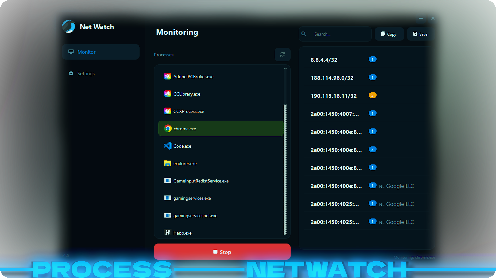

# Net Watch

<p align="center">
  
</p>

Minimalistic network monitoring tool for Windows. Track process connections, discover subnets, and get geolocation data — all in a modern dark UI.

## Features

- **Process Monitoring** — Select any running process from a live-updating list (or type it manually in Legacy Mode) and monitor its outgoing network connections in real time.
- **Subnet Discovery** — Automatically groups individual IP addresses into collapsed subnets using `ipaddress.collapse_addresses`.
- **Geolocation & ISP** — Fetches country flag emoji and ISP name for each IP via [ip-api.com](https://ip-api.com).
- **Connection Count** — Live badge showing how many active connections exist per subnet, color-coded by intensity.
- **Search & Filter** — Instantly filter the results list by IP, ISP name, or country.
- **Export** — Copy all subnets to clipboard or save to a `.txt` file.
- **Bilingual UI** — English and Russian with auto-detection based on Windows system language.
- **Modern UI** — Dark theme, animated page transitions, toast notifications, custom font (Exo 2).

## Quick Start

### Prerequisites

- Python 3.8+
- Windows (uses `psutil` for process/network enumeration, `ctypes` for language detection)

### Install & Run

```bash
pip install -r requirements.txt
python main.py
```

## Build Standalone EXE

```bash
pip install pyinstaller
pyinstaller --noconfirm --onefile --windowed --icon "assets/images/icon.png" \
  --add-data "assets;assets" --add-data "ui;ui" --add-data "core;core" \
  --name "NetWatch" main.py
```

The output binary will be in `dist/NetWatch.exe`.

## Project Structure

```
netwatch/
├── main.py                  # Entry point
├── core/
│   ├── monitor.py           # Process network monitoring (threaded)
│   ├── utils.py             # IP info, subnet collapsing, file I/O
│   └── translations.py      # EN/RU string tables
├── ui/
│   ├── main_window.py       # Main window, pages, delegates
│   ├── toast.py             # Toast notification widget
│   └── styles.py            # QSS theme and constants
└── assets/
    ├── fonts/               # Exo 2 font
    └── images/              # App icon
```

## Settings

| Setting | Description |
|---------|-------------|
| **Legacy Mode** | Switch between process list selection and manual name input |
| **Hide System Processes** | Filter out Windows/System32 processes from the list |
| **Notifications** | Enable/disable toast popups for events |
| **Auto-refresh List** | Automatically refresh the running process list every 5 seconds |
| **Language** | Switch between English and Russian (requires restart) |

## Dependencies

| Package | Purpose |
|---------|---------|
| `PyQt6` | GUI framework |
| `psutil` | Process and network monitoring |
| `qtawesome` | Font Awesome icons |
| `requests` | HTTP client for IP geolocation API |

## License

MIT License. See [LICENSE](LICENSE).
